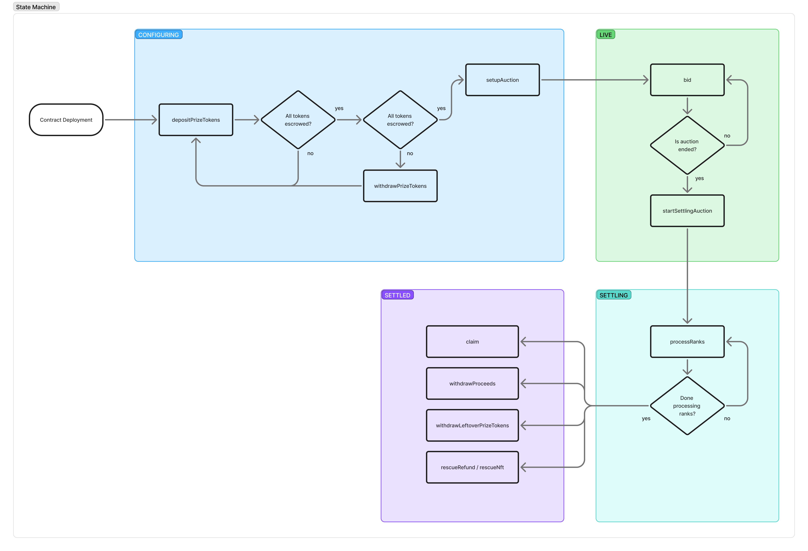
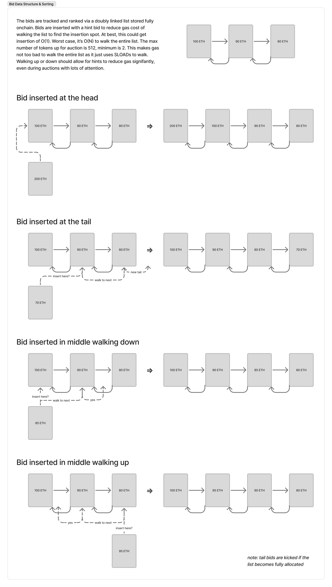
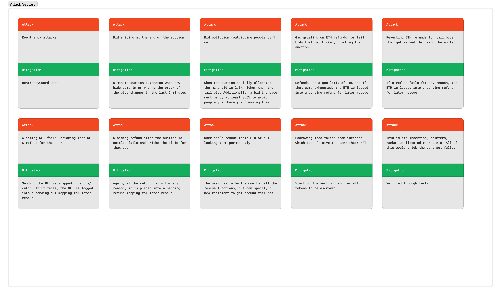

# Transient Labs Ranked Auction
A fully on-chain ranked auction that can scale from 2–512 tokens

## Motivation
When selling a batch of tokens, often, a price discovery mechanism is needed. When the number of tokens is below ~512, an English auction method is typically best (above 512, price discovery via market analysis and just doing a mint tends to be better for consumers in the digital art market).

However, it is not always desirable to list each individual token for auction, as this puts friction on the creator & consumer. If too many auctions are running at once, consumers become distracted, confused, or worse - disinterested. A ranked auction is a better solution, particularly when all the tokens don't have enough differentiation to warrant separate auctions.

This ranked auction contract aims to fulfill the need for price discovery of a batch of similar tokens in a fair, transparent, and on-chain system (see the Data Structure section for reasoning on on-chain-ness).

## How It Works
The ERC-721 tokens being sold must be minted and escrowed into the auction contract. Once escrowed, the auction can be set up and bidding commences.

Anyone can bid, so long as the auction is open and their bid is high enough. While there are fewer bids than tokens (an underallocated list), the minimum bid is just the starting bid set by the creator. Once there are as many or more bids than tokens (a fully allocated list), the minimum bid is 2.5% greater than the current lowest winning bid.

In the fully allocated list, as soon as new bids come in, the lowest winning bid is removed from the list and refunded to that bidder (if the refund transfer fails, the bidder can recover it later via a pull-based refund mechanism).

Anyone can increase their existing bids during the auction. However, you must increase your bid by at least 0.5%. This is designed to limit "dust" bids, which just pollute the blockchain and aren't of economic value.

The auction extends if any change in the ranking comes in the last 5 minutes. This could be from a new bid, or from someone increasing their bid to be in a new rank. The main purpose is to avoid bid sniping.

However, since people can continually increase bids and rearrange the order without as much economic friction as adding new bids, there is a hard cap for extensions set to 2 hours so that the auction has some definitive end. So, in theory, a 24 hour auction could at most last 26 hours. In practice, this is not expected to be seen, but it could happen.

Note: the extension is based on rank changes. If the lowest winning bid increases but the ordering stays the same, the auction does not extend. This means the clearing price can move in the final minutes without extra time being added.

Once the bidding is complete, the bids are finalized on-chain in a settlement process. This process can be called by anyone, but it is expected that the project runners call the function themselves as it involves iterating in loops. At this point, the clearing price has been set by the lowest winning bid and all winning collectors will only pay that amount.

After everything has been finalized, collectors can claim the NFT and any refund they are owed (`bid - clearingPrice`). It is expected that collectors will claim this themselves, but anyone (like the project runners) can call the function on-chain for them.

The order of the tokens given out to collectors is determined by rank, not claim order. When the tokens are escrowed, they are escrowed in the order they are expected to be given out. The highest ranking bid (i.e. the person willing to pay the most) gets the first token escrowed, the second highest gets the second token, and so on.

Projects using this contract MUST take care in ensuring they think through this reward system properly and that the more valuable tokens (if any) are given out to those that put the most at stake (higher ranks).

If for some reason the ETH refund or NFT transfer fails, it does NOT brick the contract. The ETH and NFTs can be recovered by the rightful bidder and do not rely on any admin action/trust. This is not expected to happen for 99.999% of users, but rather for people trying to DOS the system.

In an underallocated list (fewer bids than tokens), after the auction ends and is settled, the contract owner can withdraw any leftover escrowed tokens.

## Uniform Price Demand Reduction
This is a uniform-price, multi-unit auction: all winners pay the lowest winning bid. Like most auctions in this family, bidders may choose to shade bids to avoid raising the clearing price on all of their wins. This is expected behavior and is considered acceptable in this design, and it can help avoid overly aggressive clearing prices and support healthier secondary-market pricing.

## Quick Start
1. **Escrow NFTs**: mint tokens and escrow them into the auction contract (ensure approvals/ownership are correct).
2. **Configure**: set auction parameters (start/end times, starting bid, token count, etc.).
3. **Live bidding**:
   - Underallocated (< token supply): minimum bid is `startingBid`
   - Fully allocated (>= token supply): minimum bid is `lowestWinningBid * 1.025` (2.5% step up)
   - Bid increases must be at least +0.5% (anti-dust)
   - If rank changes in the last 5 minutes, extend (capped to +2 hours total)
4. **Settle**: anyone can trigger settlement; clearing price becomes the lowest winning bid (or starting price in an underallocated auction).
5. **Claim**:
   - **Winners** claim NFTs + refunds (`bid - clearingPrice`).
   - In a **fully allocated** auction, bidders who get displaced during bidding are refunded when they are removed (or the refund becomes claimable if the direct transfer fails).
   - In an **underallocated** auction, **all bidders are winners**; after settlement, the owner may withdraw any leftover escrowed NFTs.

## Operational Notes
- **Token escrow authority**: `depositPrizeTokens` is owner-only and can escrow from any `tokenOwner` that has approved the auction contract. This is an intentional admin workflow; projects should communicate this trust assumption to token holders.
- **Looped transfers are bounded**: `NUM_TOKENS` is capped at 512 (`MAX_TOKENS`) and looped calls (escrow, withdrawals, ranking) are designed around this bound. For gas safety, process withdrawals and rankings in batches via `numToProcess` when needed.

## Key Parameters
| Concept | Value | Purpose |
|---|---:|---|
| Fully-allocated outbid step | 2.5% | Ensures new bids meaningfully exceed the floor when supply is filled |
| Minimum bid-increase step | 0.5% | Prevents dust increases that bloat chain state |
| Extension window | 5 minutes | Prevent bid sniping near the end |
| Max total extensions | 2 hours | Ensures the auction ends deterministically |

## State Machine
The contract is always in either `CONFIGURING`, `LIVE`, `SETTLING`, or `SETTLED` states.


## Data Structure
The core data structure is a doubly linked list with hint bids for insertion that can get close to O(1) insertion or at worst O(N) insertion, though the looping is `SLOAD`s rather than `SSTORE`s. An alternative data structure could have just been a dynamic array, however that would have involved looping/sorting with many `SSTORE`s. 

One other structure could have been used, which is used by Art Blocks - a ladder ranked auction where bids must be in certain "rungs". This is a gas efficient method, but lacks in the ability for automated extensions and limits price discovery in some ways. Additionally, feedback from an AB engineer made it clear that the UI for it is quite hefty whereas the doubly linked list is not bad.

The reasoning for putting the entire ranking system on-chain is that this contract is unstoppable once configured. If we had chosen to go with a contract where ranking takes place off-chain, this would no longer be the case. Off-chain ranking allows for too much surface area for things to go wrong. Indexers could have stale data, scripts could have bugs, merkle trees could be miscomputed, etc. All of this would lead to invalid outcomes of the ranked auction, which is not acceptable. In turn, we sacrifice some extra resources (gas) for bidding & settlement to make sure we have an unstoppable and continually correct ranking system.



## Attack Vectors
Here are some of the attack vectors mitigated


## Test Coverage
*NOTE: since we have some invariant checks that should never fail, we cannot achieve 100% test coverage*
```
╭-------------------------+------------------+------------------+----------------+-----------------╮
| File                    | % Lines          | % Statements     | % Branches     | % Funcs         |
+==================================================================================================+
| src/TLRankedAuction.sol | 99.64% (280/281) | 99.13% (342/345) | 97.14% (68/70) | 100.00% (33/33) |
|-------------------------+------------------+------------------+----------------+-----------------|
| Total                   | 99.64% (280/281) | 99.13% (342/345) | 97.14% (68/70) | 100.00% (33/33) |
╰-------------------------+------------------+------------------+----------------+-----------------╯
```

## Gas Report
*NOTE: we do a lot of testing for worst case insertion and so the gas in practice is expected to be close to the median for bid creation & increase with a proper frontend providing good hints*
```
╭--------------------------------------------------+-----------------+---------+---------+---------+---------╮
| src/TLRankedAuction.sol:TLRankedAuction Contract |                 |         |         |         |         |
+============================================================================================================+
| Deployment Cost                                  | Deployment Size |         |         |         |         |
|--------------------------------------------------+-----------------+---------+---------+---------+---------|
| 4082834                                          | 19222           |         |         |         |         |
|--------------------------------------------------+-----------------+---------+---------+---------+---------|
|                                                  |                 |         |         |         |         |
|--------------------------------------------------+-----------------+---------+---------+---------+---------|
| Function Name                                    | Min             | Avg     | Median  | Max     | # Calls |
|--------------------------------------------------+-----------------+---------+---------+---------+---------|
| BASIS                                            | 304             | 304     | 304     | 304     | 1       |
|--------------------------------------------------+-----------------+---------+---------+---------+---------|
| CREATE_BID_BPS                                   | 282             | 282     | 282     | 282     | 1       |
|--------------------------------------------------+-----------------+---------+---------+---------+---------|
| EXTENSION_TIME                                   | 262             | 262     | 262     | 262     | 7694    |
|--------------------------------------------------+-----------------+---------+---------+---------+---------|
| claim                                            | 28889           | 66168   | 68696   | 138844  | 28      |
|--------------------------------------------------+-----------------+---------+---------+---------+---------|
| clearingPrice                                    | 2425            | 2425    | 2425    | 2425    | 4       |
|--------------------------------------------------+-----------------+---------+---------+---------+---------|
| createBid                                        | 28823           | 407263  | 105000  | 1385112 | 172794  |
|--------------------------------------------------+-----------------+---------+---------+---------+---------|
| depositPrizeTokens                               | 39710           | 1363266 | 1816318 | 1830606 | 4442    |
|--------------------------------------------------+-----------------+---------+---------+---------+---------|
| duration                                         | 2381            | 2381    | 2381    | 2381    | 14855   |
|--------------------------------------------------+-----------------+---------+---------+---------+---------|
| getAuctionInfo                                   | 7017            | 7017    | 7017    | 7017    | 1       |
|--------------------------------------------------+-----------------+---------+---------+---------+---------|
| getBids                                          | 32054           | 45560   | 45560   | 59067   | 2       |
|--------------------------------------------------+-----------------+---------+---------+---------+---------|
| getDetailedBid                                   | 5707            | 5707    | 5707    | 5707    | 330622  |
|--------------------------------------------------+-----------------+---------+---------+---------+---------|
| getHeadBid                                       | 4572            | 4572    | 4572    | 4572    | 1       |
|--------------------------------------------------+-----------------+---------+---------+---------+---------|
| getMinBid                                        | 2487            | 5068    | 5069    | 5069    | 6147    |
|--------------------------------------------------+-----------------+---------+---------+---------+---------|
| getMinBidIncrease                                | 643             | 643     | 643     | 643     | 256     |
|--------------------------------------------------+-----------------+---------+---------+---------+---------|
| getPrizeTokenIdForRank                           | 447             | 2662    | 2665    | 4870    | 4       |
|--------------------------------------------------+-----------------+---------+---------+---------+---------|
| getTailBid                                       | 4569            | 4569    | 4569    | 4569    | 3       |
|--------------------------------------------------+-----------------+---------+---------+---------+---------|
| hardEndAt                                        | 2390            | 2390    | 2390    | 2390    | 6656    |
|--------------------------------------------------+-----------------+---------+---------+---------+---------|
| head                                             | 2391            | 2391    | 2391    | 2391    | 166102  |
|--------------------------------------------------+-----------------+---------+---------+---------+---------|
| increaseBid                                      | 29115           | 41853   | 36329   | 67780   | 2304    |
|--------------------------------------------------+-----------------+---------+---------+---------+---------|
| lastProcessedId                                  | 2379            | 2379    | 2379    | 2379    | 2       |
|--------------------------------------------------+-----------------+---------+---------+---------+---------|
| listSize                                         | 2391            | 2391    | 2391    | 2391    | 165335  |
|--------------------------------------------------+-----------------+---------+---------+---------+---------|
| nextBidId                                        | 2401            | 2401    | 2401    | 2401    | 165334  |
|--------------------------------------------------+-----------------+---------+---------+---------+---------|
| nextRank                                         | 2413            | 2413    | 2413    | 2413    | 8       |
|--------------------------------------------------+-----------------+---------+---------+---------+---------|
| nextUnallocatedRank                              | 2434            | 2434    | 2434    | 2434    | 6       |
|--------------------------------------------------+-----------------+---------+---------+---------+---------|
| openAt                                           | 2434            | 2434    | 2434    | 2434    | 20487   |
|--------------------------------------------------+-----------------+---------+---------+---------+---------|
| pendingNfts                                      | 2516            | 2516    | 2516    | 2516    | 4       |
|--------------------------------------------------+-----------------+---------+---------+---------+---------|
| pendingProceeds                                  | 2405            | 2405    | 2405    | 2405    | 7       |
|--------------------------------------------------+-----------------+---------+---------+---------+---------|
| pendingRefunds                                   | 2615            | 2615    | 2615    | 2615    | 3       |
|--------------------------------------------------+-----------------+---------+---------+---------+---------|
| prizeTokenIds                                    | 4661            | 4661    | 4661    | 4661    | 50      |
|--------------------------------------------------+-----------------+---------+---------+---------+---------|
| processRanks                                     | 28887           | 50234   | 43177   | 77201   | 10      |
|--------------------------------------------------+-----------------+---------+---------+---------+---------|
| rescueNft                                        | 26853           | 40691   | 29096   | 70016   | 5       |
|--------------------------------------------------+-----------------+---------+---------+---------+---------|
| rescueRefund                                     | 26728           | 32925   | 32369   | 41254   | 6       |
|--------------------------------------------------+-----------------+---------+---------+---------+---------|
| setupAuction                                     | 29095           | 50561   | 55941   | 55958   | 1290    |
|--------------------------------------------------+-----------------+---------+---------+---------+---------|
| startSettlingAuction                             | 28602           | 50563   | 54320   | 67585   | 6       |
|--------------------------------------------------+-----------------+---------+---------+---------+---------|
| state                                            | 2490            | 2490    | 2490    | 2490    | 1036    |
|--------------------------------------------------+-----------------+---------+---------+---------+---------|
| tail                                             | 2414            | 2414    | 2414    | 2414    | 172247  |
|--------------------------------------------------+-----------------+---------+---------+---------+---------|
| withdrawLeftOverPrizeTokens                      | 29210           | 159080  | 33744   | 712233  | 7       |
|--------------------------------------------------+-----------------+---------+---------+---------+---------|
| withdrawPendingProceeds                          | 29273           | 34476   | 31769   | 43893   | 13      |
|--------------------------------------------------+-----------------+---------+---------+---------+---------|
| withdrawPrizeTokens                              | 29016           | 32078   | 29016   | 720086  | 260     |
╰--------------------------------------------------+-----------------+---------+---------+---------+---------╯
```
